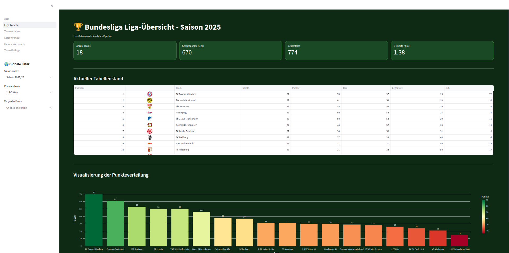
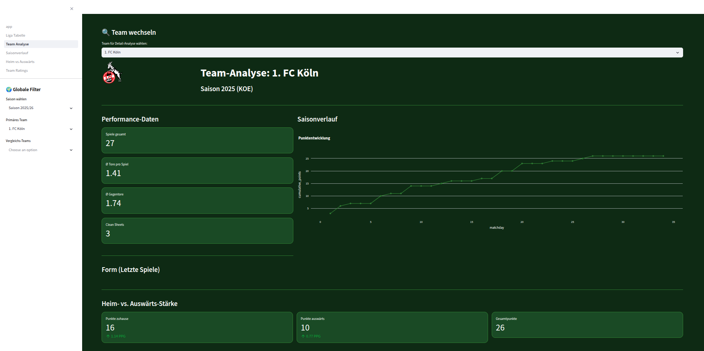
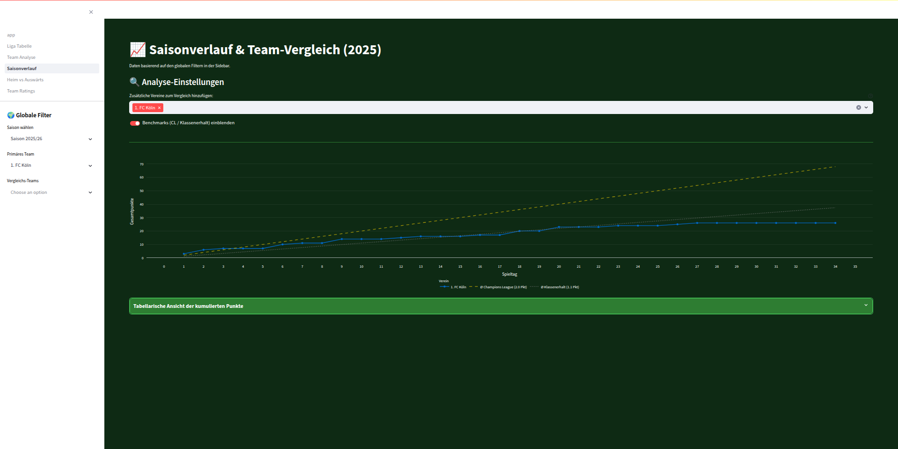
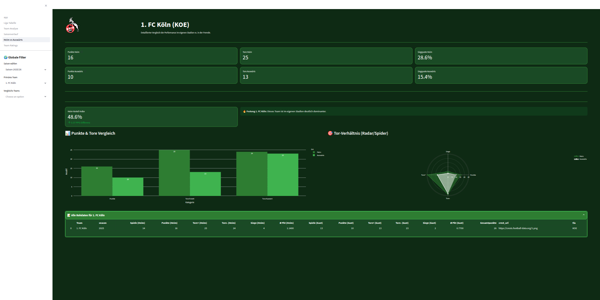
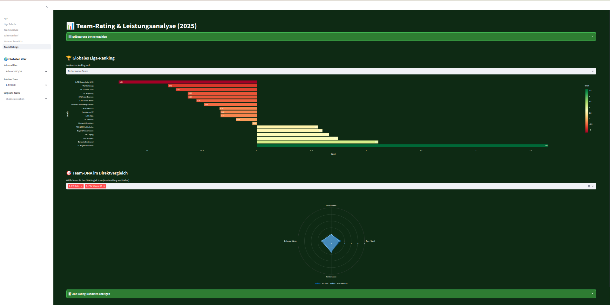

# Football Data Pipeline 🏟️

Ein automatisiertes ELT-System für Fußball-Daten der Bundesliga (2024/25 & 2025/26), basierend auf der Medallion-Architektur.

## 🛠️ Technologie-Stack
- **Ingestion:** Python (API-Requests)
- **Speicherung:** PostgreSQL (Docker)
- **Transformation:** SQL (Bronze → Silver → Gold)
- **Visualisierung:** Streamlit & Plotly

## 🏗️ Architektur (Medallion)
1. **Bronze Layer:** Rohdaten der API-Football in der Tabelle `raw_matches`.
2. **Silver Layer:** Bereinigte Basisdaten in `fact_matches`.
3. **Gold Layer:** Analytische Marts für das Dashboard (siehe unten).

## 📊 Gold Layer → Dashboard Mapping
Diese Sektion dokumentiert, welche Dashboard-Seite ihre Daten aus welcher Gold-Tabelle bezieht.

### 1. Liga-Ansicht (Tabelle)
- **Gold-Tabelle:** `fct_standings`
- **Inhalt:** Berechnet Punkte, Tore, Differenz und Platzierung pro Saison.

### 2. Team-Analyse
- **Gold-Tabelle:** `fct_team_form`
- **Inhalt:** Performance-Daten, Punktentwicklung und Formtrend eines spezifischen Teams.

### 3. Saisonverlauf (Trends)
- **Gold-Tabelle:** `fct_season_trend`
- **Inhalt:** Kumulierte Tore und Punkte über alle Spieltage hinweg zur Trend-Visualisierung.

### 4. Heim/Auswärts-Analyse
- **Gold-Tabelle:** `fct_home_away_stats`
- **Inhalt:** Detaillierte Performance-Metriken (Tore, Punkte, Siege) getrennt nach Spielort.

### 5. Leistungsanalyse (Ratings)
- **Gold-Tabelle:** `fct_team_ratings`
- **Inhalt:** Abgeleitete Metriken zur Team-Stärke basierend auf Siegquoten und Torverhältnissen.

---

## 🚀 Starten des Projekts
1. Docker Container starten: `docker-compose up -d`
2. Pipeline ausführen: `python src/main.py`
3. Dashboard starten: `streamlit run src/app.py`
