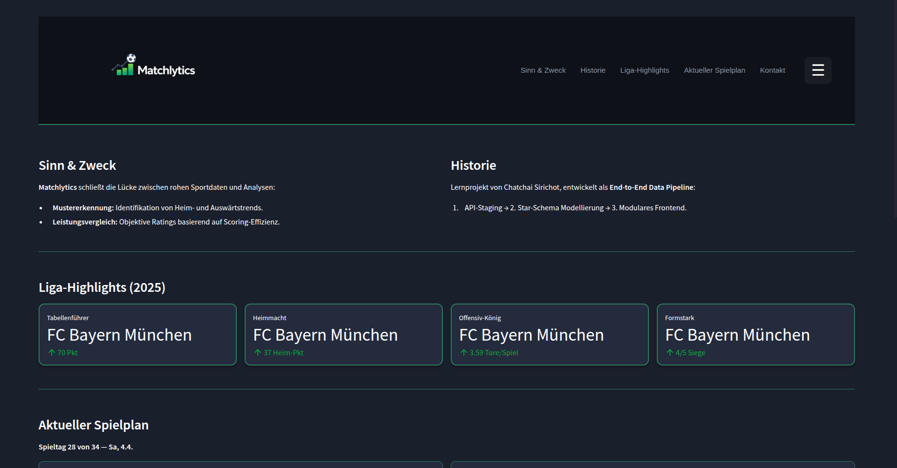
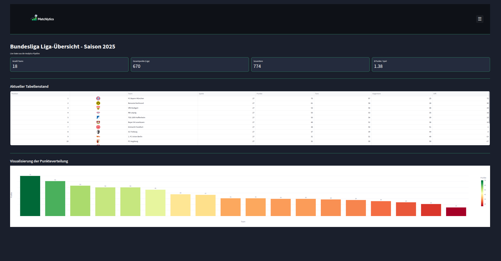
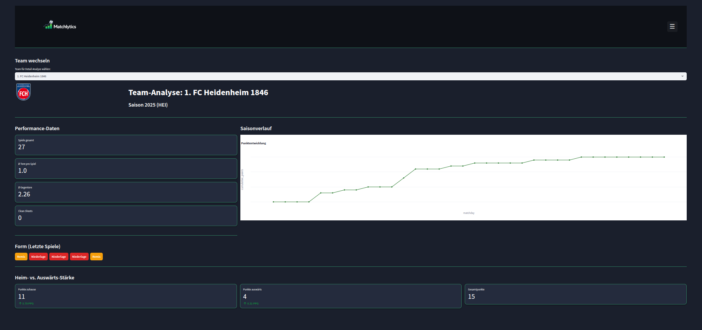
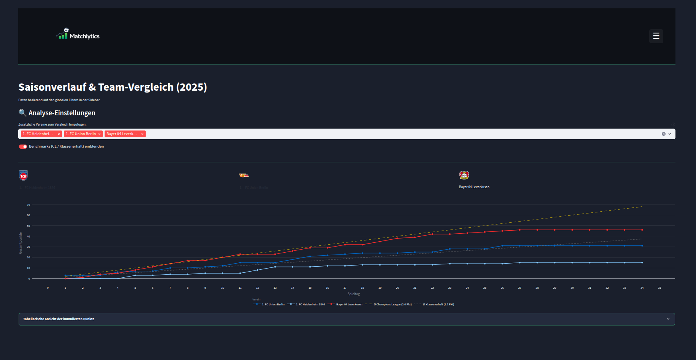
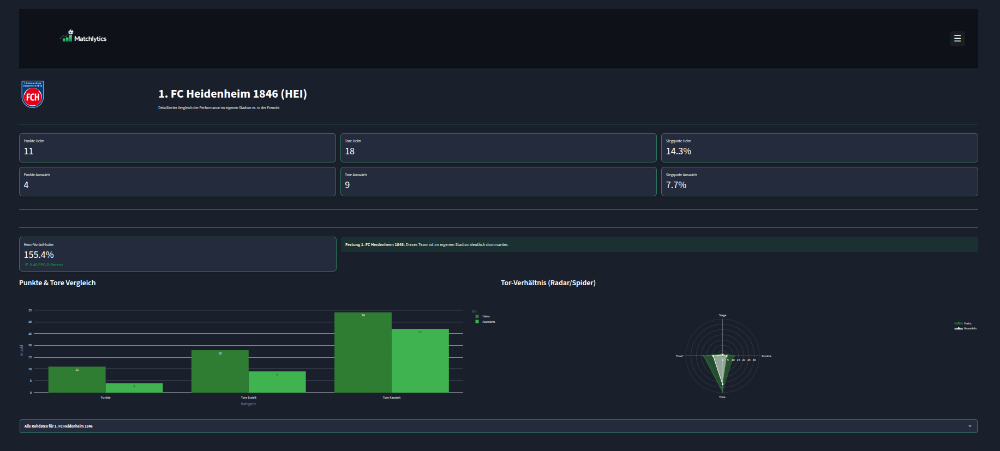
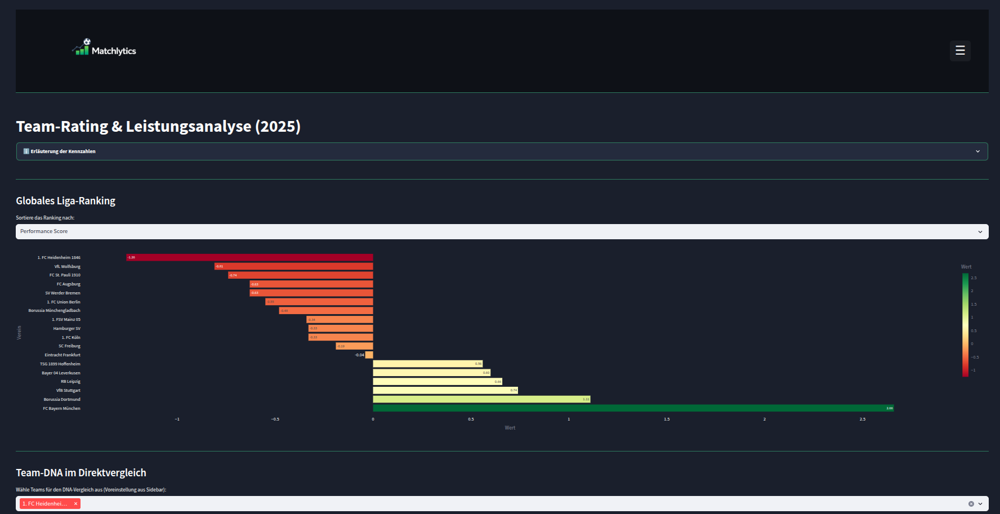
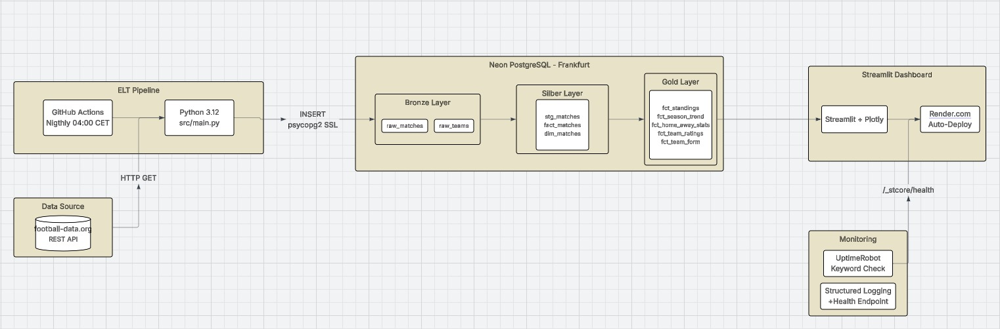

<div align="center">
  

  <h1>Matchlytics – Bundesliga Data Pipeline & Dashboard</h1>

  <p>
    <strong>End-to-end ELT pipeline</strong> that ingests live Bundesliga data nightly,<br>
    transforms it through a <strong>Medallion Architecture</strong> and serves interactive analytics.
  </p>

  <!-- Badges -->
  <p>
    
    
    
    
    
    
    
  </p>

  <p>
    <a href="https://matchlytics.onrender.com"><strong>Live-Demo →</strong></a>
  </p>
</div>

---

## Screenshots

| Landingpage | Liga-Tabelle | Team-Analyse |
|:---:|:---:|:---:|
|  |  |  |

| Saisonverlauf | Heim vs. Auswärts | Team-Ratings |
|:---:|:---:|:---:|
|  |  |  |

---

## Systemarchitektur

<div align="center">
  
</div>

---

## Tech-Stack

| Bereich | Technologie |
|---|---|
| **Sprache** | Python 3.12 |
| **Dashboard** | Streamlit 1.35 · Plotly 5.22 |
| **Datenbank** | PostgreSQL 15 – gehostet auf **Neon** (Serverless, Frankfurt) |
| **Orchestrierung** | GitHub Actions (Cron: `0 2 * * *` UTC → 04:00 CET) |
| **Containerisierung** | Docker · Docker Compose |
| **Hosting** | Render.com (Auto-Deploy von `main`) |
| **Monitoring** | UptimeRobot · Structured Logging · Health Endpoint |
| **Datenquelle** | [football-data.org](https://www.football-data.org/) REST API |

---

## Datenmodell – Medallion Architecture

### Bronze Layer — Rohdaten
Die API-Daten werden 1:1 in die Datenbank geladen.

| Tabelle | Beschreibung |
|---|---|
| `raw_matches` | Alle Bundesliga-Spiele (Saison 2024/25 + 2025/26), inkl. Ergebnis, Status, Spieltag |
| `raw_teams` | Alle Teams mit Name, Kürzel (TLA), Wappen-URL, Adresse |

### Silver Layer — Bereinigt & Normalisiert
SQL Views, die Datentypen casten und die Daten für analytische Abfragen vorbereiten.

| View | Basis | Beschreibung |
|---|---|---|
| `stg_matches` | `raw_matches` | Timestamps gecastet, Spalten bereinigt |
| `fact_matches` | `raw_matches` | Faktentabelle mit Team-IDs, Toren, Winner |
| `dim_teams` | `raw_teams` | Dimensions-Tabelle: Team-Name, TLA, Wappen |

### Gold Layer — Analytische Marts
Business-ready Views, die direkt vom Dashboard konsumiert werden.

| View | Dashboard-Seite | Beschreibung |
|---|---|---|
| **`fct_standings`** | Liga-Tabelle | Berechnet **Punkte, Tore, Tordifferenz und Platzierung** pro Team & Saison. Enthält `points_per_match` als Effizienz-KPI. |
| **`fct_season_trend`** | Saisonverlauf | **Kumulierte Punkte** pro Spieltag via Window-Function (`SUM ... OVER`). Ermöglicht Trendvergleiche zwischen Teams über eine Saison. |
| **`fct_home_away_stats`** | Heim vs. Auswärts | Getrennte Performance-Metriken (Punkte, Tore, Siege, PPG) für **Heim- und Auswärtsspiele**. Zeigt Heim-/Auswärtsstärke. |
| **`fct_team_ratings`** | Leistungsanalyse | **Offensive** (Tore/Spiel), **Defensive** (Gegentore/Spiel) und **Clean Sheets**. Dient zur Bewertung der Gesamtstärke. |
| **`fct_team_form`** | Team-Analyse | Aggregiert die **letzten 5 Ergebnisse** (W-D-L) via `STRING_AGG()` zu einem Formtrend-String pro Team & Saison. |

---

## Quickstart

### Voraussetzungen
- [Docker](https://docs.docker.com/get-docker/) & Docker Compose
- API-Key von [football-data.org](https://www.football-data.org/) (kostenlos)

### 1. Repository klonen
```bash
git clone https://github.com/Chatchai-lab/football-data-pipeline.git
cd football-data-pipeline
```

### 2. Umgebungsvariablen setzen
```bash
cp .env.example .env
# .env mit den eigenen Werten befüllen:
#   DB_USER, DB_PASSWORD, DB_HOST, DB_NAME, DB_PORT,
#   DB_SSLMODE=require, FOOTBALL_API_KEY
```

### 3. ELT-Pipeline ausführen
```bash
# Virtuelle Umgebung (empfohlen)
python -m venv .venv && source .venv/bin/activate
pip install -r requirements.txt
export PYTHONPATH=$PWD

# Pipeline starten (Ingestion → Transformation)
python src/main.py
```

### 4. Dashboard starten
```bash
# Option A: Lokal
streamlit run src/app.py

# Option B: Docker
docker compose up -d --build
# → http://localhost:8501
```

---

## Projektstruktur

```
football-data-pipeline/
├── .github/workflows/
│   └── pipeline.yml          # Nightly ELT via GitHub Actions
├── docs/
│   ├── architecture/          # Architekturdiagramm (PNG)
│   ├── logo/                 # Logo & Favicon
│   └── screenshots/          # Dashboard-Screenshots
├── sql/staging/
│   ├── stg_matches.sql       # Silver: Staging View
│   ├── fact_matches.sql      # Silver: Fact View
│   ├── dim_teams.sql         # Silver: Dimension View
│   ├── fct_standings.sql     # Gold: Liga-Tabelle
│   ├── fct_season_trend.sql  # Gold: Saisonverlauf
│   ├── fct_home_away_stats.sql # Gold: Heim/Auswärts
│   ├── fct_team_ratings.sql  # Gold: Team-Ratings
│   └── fct_team_form.sql     # Gold: Formtrend
├── src/
│   ├── app.py                # Streamlit Entrypoint
│   ├── main.py               # ELT Pipeline Runner
│   ├── ingestion/            # API → Bronze
│   ├── transformation/       # Bronze → Silver → Gold
│   ├── pages/                # Dashboard-Seiten (00–06)
│   └── utils/                # DB Client, Logger, Styles, Components
├── tests/                    # pytest – DB Integrity Checks
├── Dockerfile                # Image (python:3.12-slim)
├── docker-compose.yml        # Single-Service Compose (App → Neon DB)
└── requirements.txt          # Pinned Dependencies
```

---

## CI/CD & Monitoring

| Feature | Details |
|---|---|
| **Nightly ELT** | GitHub Actions Cron (04:00 CET), inklusive Auto-Issue bei Fehler |
| **Auto-Deploy** | Push auf `main` → Render baut & deployed automatisch |
| **Health Endpoint** | `/_stcore/health` → `ok` (Streamlit built-in) |
| **UptimeRobot** | Keyword-Monitoring prüft Health Endpoint alle 5 Min. |
| **Structured Logging** | Zentraler Logger mit konfigurierbarem `LOG_LEVEL` |
| **DB-Status** | Live-Anzeige im Dashboard-Footer (Online/Offline, letzte Aktualisierung) |

---

## Lizenz

Dieses Projekt dient als Portfolio-Projekt. Datenquelle: [football-data.org](https://www.football-data.org/).

---

<div align="center">
  <sub>Built by <a href="https://github.com/Chatchai-lab">Chatchai</a></sub>
</div>
