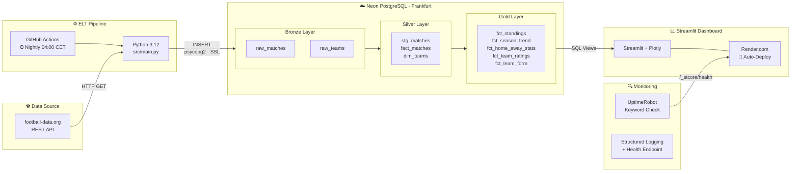

# Matchlytics – System Architecture

```mermaid
flowchart LR
    subgraph Source["⚽ Data Source"]
        API["football-data.org\nREST API"]
    end

    subgraph Pipeline["⚙️ ELT Pipeline"]
        direction TB
        GH["GitHub Actions\n⏰ Nightly 04:00 CET"]
        PY["Python 3.12\nsrc/main.py"]
        GH --> PY
    end

    subgraph Cloud_DB["☁️ Neon PostgreSQL · Frankfurt"]
        direction TB
        subgraph Bronze["Bronze Layer"]
            RAW_M["raw_matches"]
            RAW_T["raw_teams"]
        end
        subgraph Silver["Silver Layer"]
            STG["stg_matches\nfact_matches\ndim_teams"]
        end
        subgraph Gold["Gold Layer"]
            FCT["fct_standings\nfct_season_trend\nfct_home_away_stats\nfct_team_ratings\nfct_team_form"]
        end
        Bronze --> Silver --> Gold
    end

    subgraph Frontend["📊 Streamlit Dashboard"]
        direction TB
        ST["Streamlit + Plotly"]
        RENDER["Render.com\n🚀 Auto-Deploy"]
        ST --- RENDER
    end

    subgraph Monitoring["🔍 Monitoring"]
        UR["UptimeRobot\nKeyword Check"]
        LOG["Structured Logging\n+ Health Endpoint"]
    end

    API -->|"HTTP GET"| PY
    PY -->|"INSERT\npsycopg2 · SSL"| Bronze
    Gold -->|"SQL Views"| ST
    UR -->|"/_stcore/health"| RENDER
```
